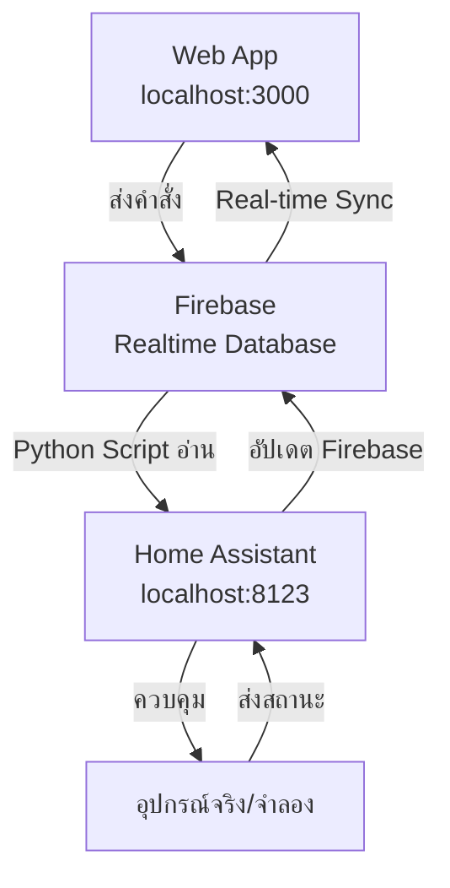

# 🚀 Quick Start Guide - สร้าง Home Assistant

## ⚡ **วิธีเร็วที่สุด (5 นาที)**

```bash
# 1. ตรวจสอบว่ามี Docker แล้ว
docker --version

# 2. (ถ้ายังไม่มี) ติดตั้ง Docker
brew install --cask docker  # macOS
# หรือ sudo apt install docker.io  # Linux

# 3. รันสคริปต์อัตโนมัติ
cd /Users/tatchakorn/Documents/React-Dashboard
./install-homeassistant.sh

# 4. รอ 2-3 นาที แล้วเปิด
http://localhost:8123
```

---

## 🔗 **การเชื่อมต่อระบบ (Flow การทำงาน)**

### **📱 Web App → Firebase → Home Assistant → อุปกรณ์**



### **🔄 ขั้นตอนการทำงาน:**

#### **1. ผู้ใช้กดปุ่มในเว็บแอป:**
```javascript
// ใน HomeAssistantService.js
const controlDevice = async (deviceId, action, parameters) => {
  const commandRef = ref(db, `homeassistant/commands/${memberId}/${deviceId}`);
  await set(commandRef, {
    action: 'light.turn_on',
    parameters: { entity_id: 'light.it_office' },
    timestamp: Date.now(),
    status: 'pending'
  });
};
```

#### **2. Firebase เก็บคำสั่ง:**
```json
{
  "homeassistant": {
    "commands": {
      "member_1692778800000": {
        "device_123": {
          "action": "light.turn_on",
          "parameters": { "entity_id": "light.it_office" },
          "timestamp": 1692778800000,
          "status": "pending"
        }
      }
    }
  }
}
```

#### **3. Home Assistant อ่านคำสั่ง (ทุก 5 วินาที):**
```python
# ใน firebase_listener.py
def check_firebase_commands():
    url = f"{FIREBASE_URL}/homeassistant/commands.json"
    response = requests.get(url)
    commands = response.json()
    
    for member_id, member_commands in commands.items():
        for device_id, command in member_commands.items():
            if command.get('status') == 'pending':
                execute_command(member_id, device_id, command)
```

#### **4. Home Assistant ดำเนินการ:**
```python
def execute_command(member_id, device_id, command):
    action = command.get('action')
    entity_id = command['parameters']['entity_id']
    
    if action == 'light.turn_on':
        hass.services.call('light', 'turn_on', {'entity_id': entity_id})
```

#### **5. อุปกรณ์เปลี่ยนสถานะ และส่งกลับ:**
```python
# ใน send_device_updates.py (เมื่อสถานะเปลี่ยน)
def send_device_status(entity_id, new_state):
    device_data = {
        'entity_id': entity_id,
        'state': new_state,  # 'on' หรือ 'off'
        'last_updated': time.time()
    }
    
    url = f"{FIREBASE_URL}/homeassistant/devices/{member_id}/{device_id}.json"
    requests.put(url, json=device_data)
```

#### **6. Web App อัปเดตแบบ Real-time:**
```javascript
// ใน HomeAssistantControl.js
useEffect(() => {
  const devicesRef = ref(db, `homeassistant/devices/${selectedMember}`);
  const unsubscribe = onValue(devicesRef, (snapshot) => {
    setDevices(snapshot.val());  // อัปเดต UI ทันที
  });
}, [selectedMember]);
```

---

## 📋 **สิ่งที่เกิดขึ้นหลังติดตั้ง Home Assistant**

### **✅ อุปกรณ์จำลองที่มี:**
- 💡 `light.it_office` - ไฟสำนักงาน IT
- 💡 `light.hr_office` - ไฟสำนักงาน HR  
- 💡 `light.meeting_a` - ไฟห้องประชุม A
- 🔌 `switch.server_room` - สวิตช์ห้องเซิร์ฟเวอร์
- 🔌 `switch.projector_a` - โปรเจคเตอร์ห้อง A
- 🌡️ `sensor.it_temperature` - อุณหภูมิแผนก IT
- 💧 `sensor.it_humidity` - ความชื้นแผนก IT
- 🌡️ `sensor.hr_temperature` - อุณหภูมิแผนก HR

### **🔄 Automation ที่ทำงาน:**
- ⏰ ตรวจสอบคำสั่งจาก Firebase ทุก 5 วินาที
- 📡 ส่งสถานะอุปกรณ์เมื่อมีการเปลี่ยนแปลง
- 📊 ส่งข้อมูลเซ็นเซอร์ทุก 30 วินาที

---

## 🧪 **การทดสอบระบบ**

### **ขั้นตอนการทดสอบ:**

1. **เปิดเว็บแอป:** http://localhost:3000
2. **เข้าสู่ระบบ** (สมัครใหม่หรือใช้บัญชีที่มี)
3. **ไปหน้าจัดการสมาชิก** (สำหรับ Admin)
4. **เลือก "แผนก IT"**
5. **กดปุ่มเปิด "ไฟสำนักงาน IT"**

### **สิ่งที่ควรเกิดขึ้น:**

1. **ใน Web App:** ปุ่มเปลี่ยนสถานะทันที
2. **ใน Firebase Console:** มีคำสั่งใหม่ใน `commands/`
3. **ใน Home Assistant Log:** ข้อความ "Executed command"
4. **ใน Home Assistant States:** `light.it_office` เปลี่ยนเป็น `on`
5. **กลับใน Web App:** สถานะอัปเดตเป็น "เปิด"

### **การตรวจสอบปัญหา:**

```bash
# ดู Home Assistant Log
docker logs homeassistant

# ดู Web App Console (F12)
# ตรวจสอบ Network tab

# ดู Firebase Console
https://console.firebase.google.com/project/iot-dashboard-86cce/database
```

---

## 📁 **ไฟล์สำคัญที่สร้างแล้ว**

```
React-Dashboard/
├── HA_INSTALLATION_STEPS.md          # คู่มือติดตั้งโดยละเอียด
├── install-homeassistant.sh          # สคริปต์ติดตั้งอัตโนมัติ
├── homeassistant-config/             # ไฟล์ตั้งค่า Home Assistant
│   ├── configuration.yaml            # การตั้งค่าหลัก
│   └── python_scripts/               # สคริปต์เชื่อมต่อ Firebase
│       ├── firebase_listener.py      # รับคำสั่งจาก Firebase
│       ├── send_device_updates.py    # ส่งสถานะอุปกรณ์
│       └── send_sensor_data.py       # ส่งข้อมูลเซ็นเซอร์
├── INSTALLATION_GUIDE.md             # คู่มือติดตั้งทั้งระบบ
├── EASY_SETUP_GUIDE.md               # คู่มือตั้งค่าแบบง่าย
└── INTERNAL_USE_MODEL.md             # โมเดลการใช้งานองค์กร
```

---

## 🎯 **สรุป - สิ่งที่ต้องทำ**

### **🟢 พร้อมใช้งานแล้ว:**
- ✅ Web App รันบน localhost:3000
- ✅ ข้อมูลตัวอย่างใน Firebase
- ✅ ไฟล์ตั้งค่า Home Assistant

### **🟡 ขั้นตอนต่อไป (ถ้าต้องการ Home Assistant จริง):**
- 🔄 รันสคริปต์: `./install-homeassistant.sh`
- ⏳ รอ 2-3 นาที
- 🌐 เปิด http://localhost:8123
- 🧪 ทดสอบการควบคุมอุปกรณ์

### **🔵 การใช้งานจริง (อนาคต):**
- 🏠 ติดตั้งบน Raspberry Pi
- 📡 เชื่อมต่ออุปกรณ์จริง (Zigbee, WiFi)
- 🏢 Deploy ไปใช้งานในองค์กร

**🚀 ตอนนี้ทุกอย่างพร้อมแล้ว! ลองรันสคริปต์ติดตั้งดูครับ**
